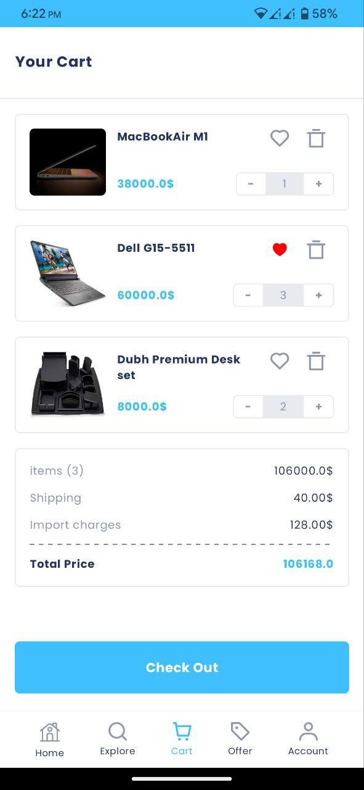
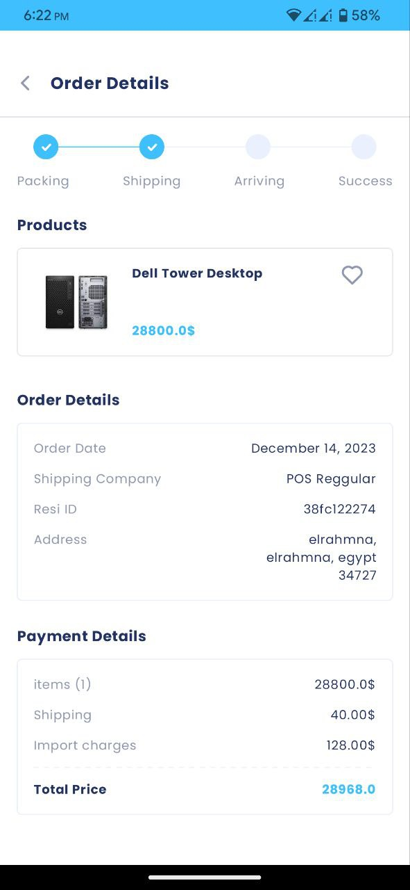
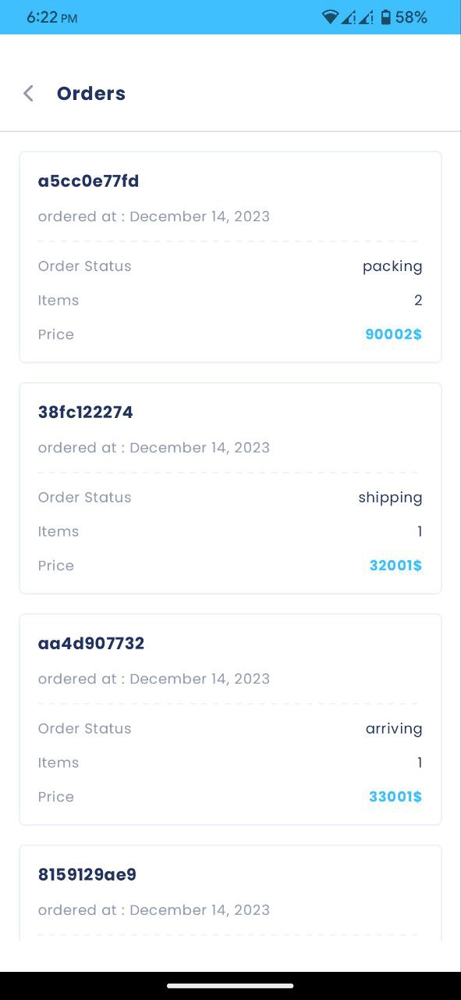
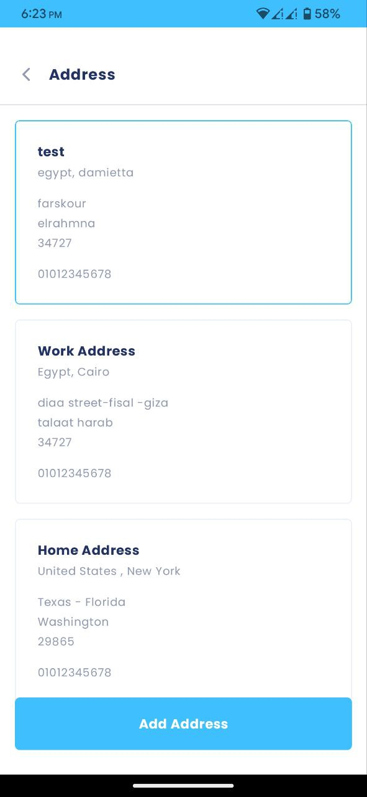

# Omni Cart

Omni Cart is an E-Commerce android application that has the most features required in the e-commerce process.

Available on MediaFire Store and soon also on Google Play.

## Screenshots

   
   
   
    
    
  
  
  
  
  

### 🧑🏻‍💻 Android development

- Application is entirely written in [Kotlin](https://kotlinlang.org)
- Complete migrated to [Jetpack Compose](https://developer.android.com/jetpack/compose)
- Following the [Material You](https://m3.material.io/) guidelines and dynamic color
- Asynchronous processing using [Coroutines](https://kotlin.github.io/kotlinx.coroutines/)
- Dependency injection with [Hilt](https://dagger.dev/hilt/)
- Architectural pattern using [Clean Architecture with MVVM](https://blog.cleancoder.com/uncle-bob/2012/08/13/the-clean-architecture.html)
- Data Persistence by [DataStore](https://developer.android.com/topic/libraries/architecture/datastore)
- Restful APIs using [Retrofit](https://square.github.io/retrofit/)

### Features ✨

- Full authentication system (login - register - forgot password).
- Display all types of products and categories in an easy way.
- Search for a particular product (sort and filter included).
- Favorites feature.
- Recommendation system.
- Cart and checkout process.
- See what if there are offers now in the offers screen.
- Track your orders and get a log of the orders you made before.
- Ability to add multiple addresses and ship to one of them when checkout.
- Payment Process

## Find this repository useful? :heart:
Support it by putting a star for this repository. :star:  
Also, __[follow me](https://github.com/3wiida)__ on GitHub for my next creations! 🤩
